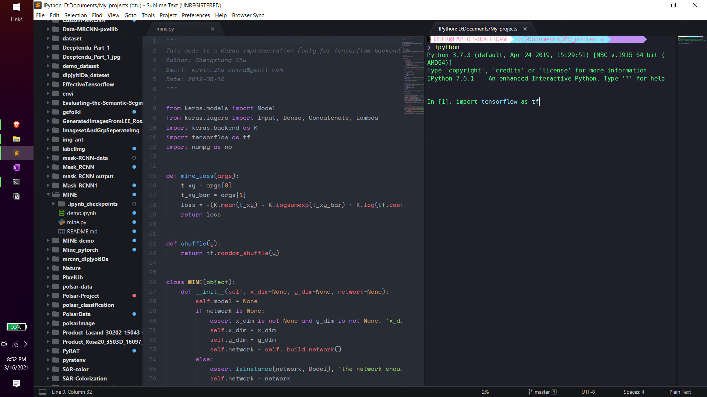
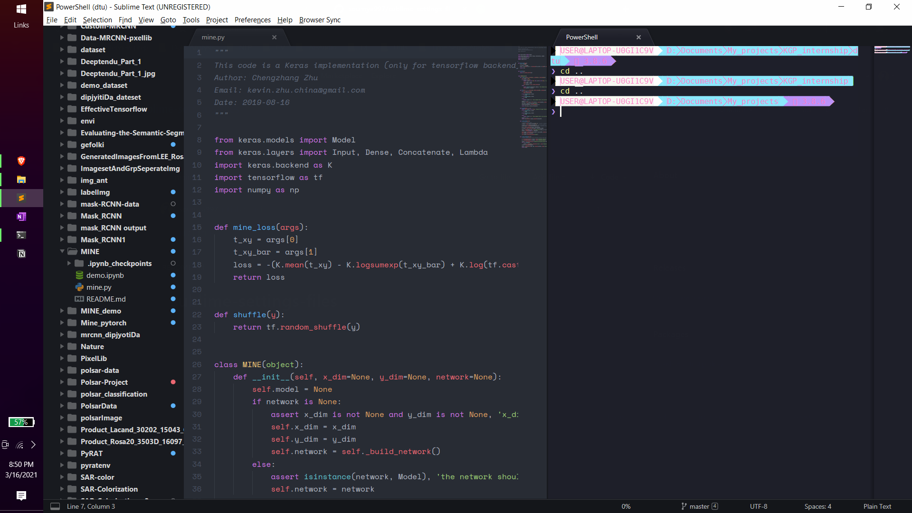
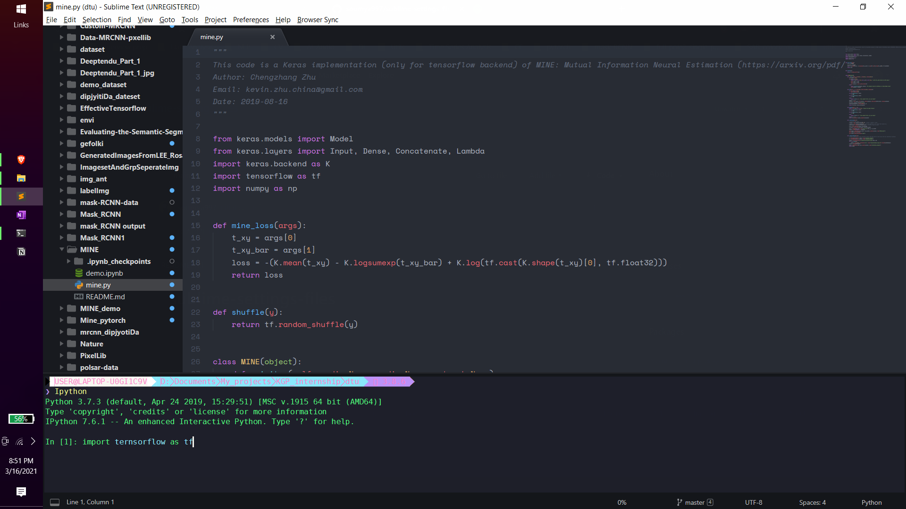
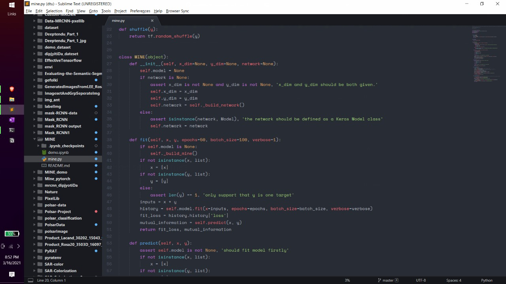
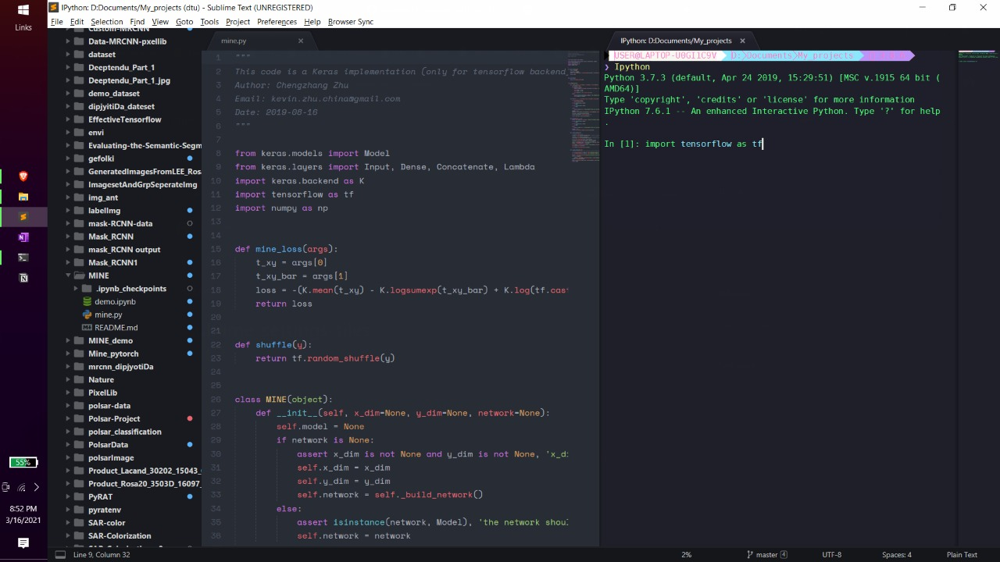

# Sublime settings files

I put my sublime text 3 settings JSON files here, just putting those for portability. Sublime is a lightweight but effective code editor at least not like vs code that starts crashing just after enabling my python extension so I have ditched it. In comparison to vs code, sublime is nothing but it does the job, and one of its great things is its customizability. So sublime you go ahead. 

PS: the settings is applicable only for windows10. 
# This is how my sublime look:

 
<pre>
         
</pre>
