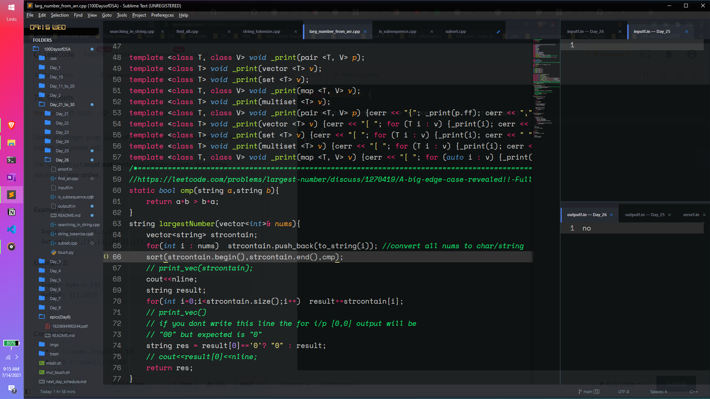
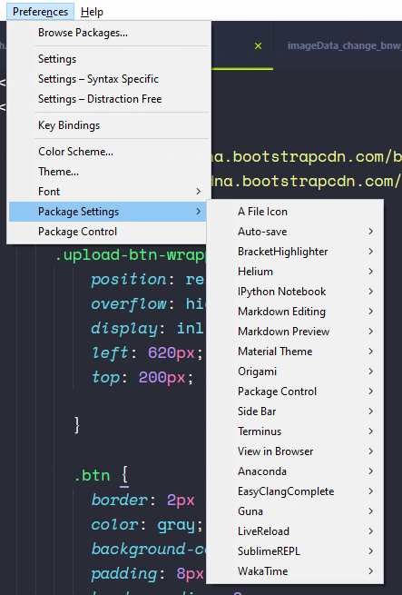

# Sublime settings files

I put my sublime text 3 settings JSON files here, just putting those for portability. Sublime is a lightweight but effective code editor at least not like vs code that starts crashing just after enabling my python extension so I have ditched it. In comparison to vs code, sublime is nothing but it does the job, and one of its great things is its customizability. So sublime you go ahead. 

PS: the settings is applicable only for windows10. 
# This is how my sublime look:

<br>
<pre>
             
</pre>

# Extensions that I use:
<p align="center">
    
</p>

#### Packages Names:
- Colorsublime


# change the color of the comments from the color scheme:
I needed to change the color of the comments in my color scheme, I'm using cobult, so it was giving me darkish blue, but i wanted it to be greenish, so I changed it.

1. go to the customize color scheme from the preference, it will open a xml file, but thats default, for changing stuff you need make changes to the json format file that open right beside it. 
2. In the variables define some color values,
3. and for changing the comments you add a rule specific to comment.Like this,
4. If you want to see other rules, like color for numbers, strings, functions, classes etc. then install `Package Resource Viewer` from control install package. then shift+ctrl+p then type `prv`, `Package Resource Viewer-Open source` will show up, go to the color scheme - default and check out any color schemes, it will open a json, from there you can see the rules.

```json
// Documentation at https://www.sublimetext.com/docs/color_schemes.html
{
    "name": "colult",
    "author": "Sublime HQ Pty Ltd",
    "variables":
    {
        // These colors are part of the hashed range
        // and should only be used in non-source
        "purple": "hsla(260, 50%, 60%, 1)",
        "blue": "hsla(200, 70%, 45%, 1)",
        "teal": "hsla(170, 70%, 45%, 1)",
        "green": "hsla(130, 70%, 45%, 1)",
        // End of hashed range colors
        "red": "hsla(0, 70%, 65%, 1)",
        "orange": "hsla(25, 90%, 60%, 1)",
        "dark_orange": "hsla(10, 90%, 60%, 1)",
        "yellow": "hsla(50, 100%, 60%, 1)",
        "brown": "hsla(30, 30%, 45%, 1)",
        "dark_brown": "hsla(30, 30%, 30%, 1)",
        "magenta": "hsla(335, 100%, 65%, 1)",
        "light_gray": "#f6f6f6",
        "dark_gray": "#333",
        "black": "black",
        "pink": "#e371f5",
        "lemon":"hsla(89, 100%, 58%, 0.92)"
    },
    "globals":
    {
        "caret": "color(var(lemon))",
    },
    "rules":
    [
        {
            "scope": "comment",
            "foreground": "#12fc73",
            "font_style": "italic"
        },

    ]
}
```  
### My Cobult(color scheme) + Guna(theme) customizations:  

```json
// Documentation at https://www.sublimetext.com/docs/color_schemes.html
{
    "name": "colult",
    "author": "Sublime HQ Pty Ltd",
    "variables":
    {
        // These colors are part of the hashed range
        // and should only be used in non-source
        "purple": "hsla(260, 50%, 60%, 1)",
        "blue": "hsla(200, 70%, 45%, 1)",
        "teal": "hsla(170, 70%, 45%, 1)",
        "green": "hsla(130, 70%, 45%, 1)",
        // End of hashed range colors
        "red": "hsla(0, 70%, 65%, 1)",
        "orange": "hsla(25, 90%, 60%, 1)",
        "dark_orange": "hsla(10, 90%, 60%, 1)",
        "yellow": "hsla(50, 100%, 60%, 1)",
        "brown": "hsla(30, 30%, 45%, 1)",
        "dark_brown": "hsla(30, 30%, 30%, 1)",
        "magenta": "hsla(335, 100%, 65%, 1)",
        "light_gray": "#f6f6f6",
        "dark_gray": "#333",
        "black": "black",
        "pink": "#e371f5",
        "lemon":"hsla(89, 100%, 58%, 0.92)"
    },
    "globals":
    {
        "caret": "color(var(lemon))",
    },
    "rules":
    [
        {
            "scope": "comment",
            "foreground": "#12fc73",
            "font_style": "italic"
        },

    ]
}
```
### Keyboard shortcut to copy the current line?

- https://forum.sublimetext.com/t/keyboard-shortcut-to-copy-the-current-line/35591/8
 
# Terminus Theme:
- hipster-green
